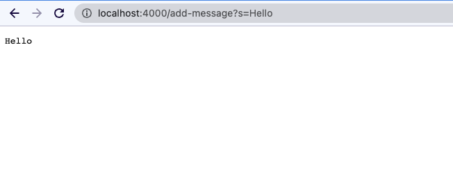
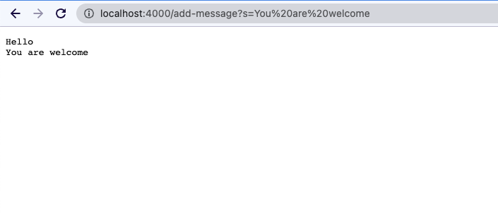

#Lab Report2: Servers and Bugs

> Part1 StringServer
1. Code for StringServer

```
import java.io.IOException;
import java.net.URI;

class Handler implements URLHandler {
    // The one bit of state on the server: a number that will be manipulated by
    // various requests.
    String str = "";
    public String handleRequest(URI url) {
        if (url.getPath().equals("/")) {
            return str;
        } else {
            System.out.println("Path: " + url.getPath());
            if (url.getPath().contains("/add-message")) {
                String[] parameters = url.getQuery().split("=");
                if (parameters[0].equals("s")) {
                    str += parameters[1];
                    str += "\n";
                    return str;
                }
            }
            return "404 Not Found!";
        }
    }
}

class StringServer {
    public static void main(String[] args) throws IOException {
        if(args.length == 0){
            System.out.println("Missing port number! Try any number between 1024 to 49151");
            return;
        }
        int port = Integer.parseInt(args[0]);

        Server.start(port, new Handler());
    }
}
```
2. Add "Hello"



This calls the handleRequest method.

The relevant argument is:
```
if (url.getPath().contains("/add-message")) {
  String[] parameters = url.getQuery().split("=");
  if (parameters[0].equals("s")) {
    str += parameters[1];
    str += "\n";
    return str;
  }
}
```
The relevant class instance is `str`. Also, the `String[] parameters` and method parameter `url` changed

The method parameter `url` changed since I entered a different url, which is `http://localhost:4000/add-message?s=Hello`

The value `parameters` represent the query part of the url. Since the url changed, the parameters also changed to `{"s", "Hello"}`

The class instance `str` changed since we are adding the part of query to `str` so that it could display on the website. The new `str` would be 
`"Hello\n"`

3. Add "How are you"



This calls the handleRequest method.

The relevant argument is:
```
if (url.getPath().contains("/add-message")) {
  String[] parameters = url.getQuery().split("=");
  if (parameters[0].equals("s")) {
    str += parameters[1];
    str += "\n";
    return str;
  }
}
```

The relevant class instance is `str`. Also, the `String[] parameters` and method parameter `url` changed

The method parameter `url` changed since I entered a different url, which is `http://localhost:4000/add-message?s=How are you`

The value `parameters` represent the query part of the url. Since the url changed, the parameters also changed to `{"s", "How are you"}`

The class instance `str` changed since we are adding the part of query to `str` so that it could display on the website. The new `str` would be 
`"Hello\nHow are you\n"`

> Part2 Bugs and Debugging

I would chooose the `reverseInPlace` in the ArrayExamples
1. A failure-inducing input

```
@Test
public void testReverseInPlaceLargeArray() {
   int[] input1 = {1, 2, 3, 4, 5};
   int[] output1 = {5, 4, 3, 2, 1};
   ArrayExamples.reverseInPlace(input1);
   assertArrayEquals(output1, input1);
}
```

2. Input that doesn't induce failure

```
@Test 
public void testReverseInPlace() {
  int[] input1 = { 3 };
  ArrayExamples.reverseInPlace(input1);
  assertArrayEquals(new int[]{ 3 }, input1);
```
3. Symptom

The desired output for the tester is : 5, 4, 3, 2, 1

The output for the tester is : 5, 4, 3, 4, 5


