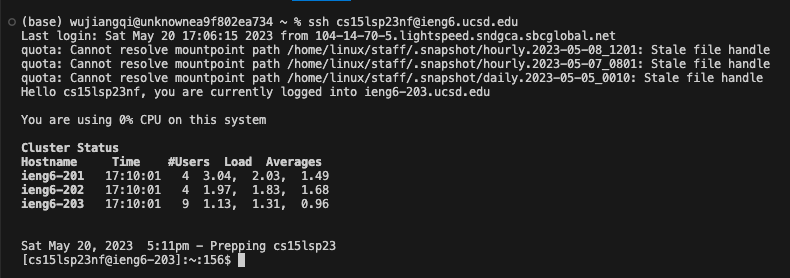
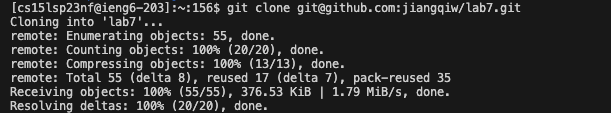
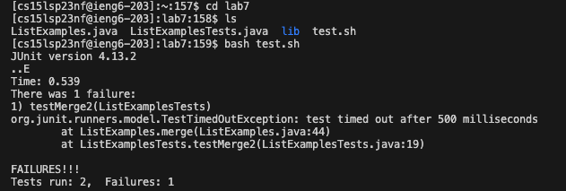

# Lab Report 4 -- Editing from Command Line

In this lab report, I would reproduce the task done in the lab, and perform the step 4-9 and explain the keys pressed during each step.

## Step 4: Log into ieng6

Keys pressed:

`ssh<space>cs15lsp23nf@ieng6.ucsd.edu<enter>`



In this command, I logged onto the ieng6 by using ssh and typing my ieng6 account

## Step 5: Clone the repository

Keys pressed:

`git<space>clone<space><Command -V><enter>`



In this command, I clone the repository named `lab7` from my github.

I use `<Command -V>` to paste the clone address by SSH, which is `git@github.com:jiangqiw/lab7.git`. By copying this link, I can clone the repo and is able to git commit and push to update my changes.

## Step 6: Run the test and demonstrate fail

Keys pressed:

```
cd<space>lab7<enter>
ls<enter>
bash<space>test.sh<enter>
```



In the command, I first use `cd` to move to the correct directory and `ls` to see all the files in the directory. Then I use `bash` to run the `test.sh` file, which is already written to run the test. Since there is bug in the `ListExamples` file, so I see failure reported

## Step 7: Editing the code

Keys pressed:

```
vim<space>ListExamples.java<enter>
j # 43 times
l # 11 times
x
i
2
<Esc>
:wq<enter>
```


In the command, I first use `vim` to open the `ListExamples.java` and is able to edit it. I then use `j` and 'l' to move to the location where I need to get the bug fixed. Then, I use `x` command to delete the wrong statement, which is `1`, then I type `i` to enter insert mode and insert `2` at the location. I then press `<Esc>` to 
exit the insert mode and `wq` to save and exit vim.

## Step8: Run the test again

Keys pressed:

```
<up arrow><up arrow><enter>
```


I use the bash hitory and get the history of `bash test.sh`, to run the test again. Since the bug is fixed, to the test file run successfully.
