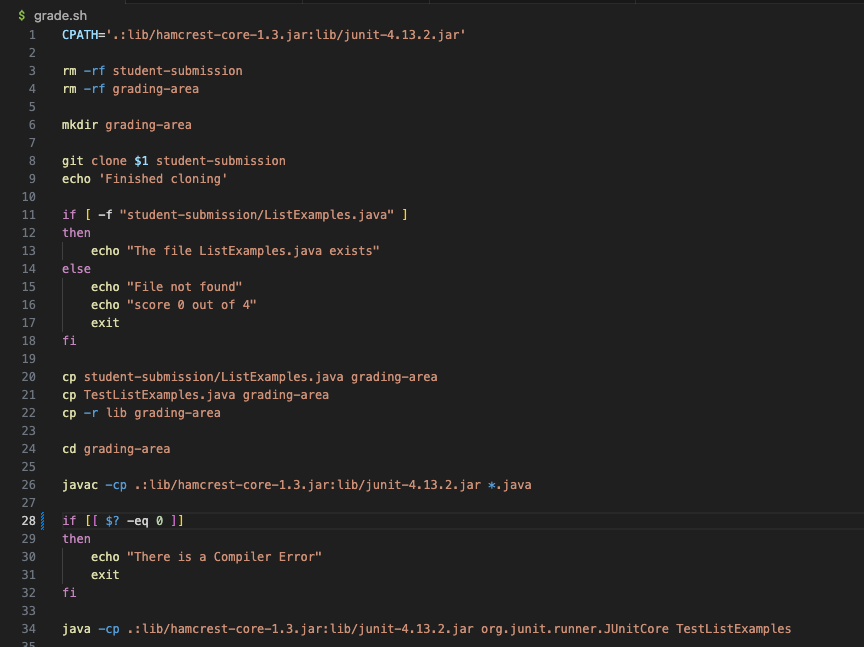
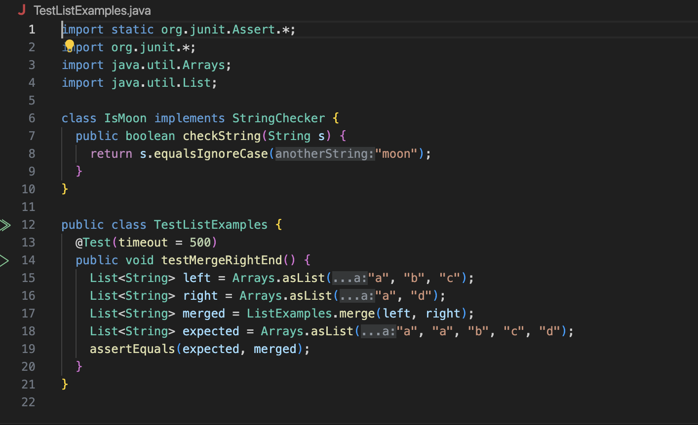
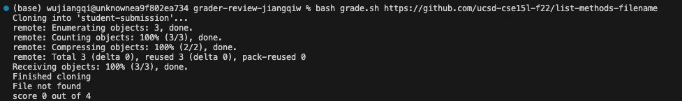
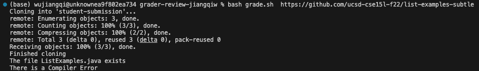

# Lab Report 5: Debugging Scenario

In this lab report, I will design a scenario that a student encounter bugs and TA tries to solve the bug.

# Part1: Origin Post with Bug Description

## Part1: Student's Original Post

### Title: Having weird bug with GradeServer

### Category: Debugging

### Description:

> What environment are you using (computer, operating system, web browser, terminal/editor, and so on)?

I am working on MAC computer and running my code in VS Code terminal.

> Detail the symptom you're seeing. Be specific; include both what you're seeing and what you expected to see instead. Screenshots are great, copy-pasted terminal output is also great. Avoid saying “it doesn't work”.

I have finished coding the grade.sh script and when I was trying to run bash grade.sh with correct implementation, it just shows hint of compiler error of the file. However, the file is supposed to be implemented correctly. Here is a screenshot of running the command.


> Detail the failure-inducing input and context. That might mean any or all of the command you're running, a test case, command-line arguments, working directory, even the last few commands you ran. Do your best to provide as much context as you can.

I have called bash scripts in the directory, and I use the correct implementation of list methods, which is given in the Week 6 lab. Here is the command I run that produce failure:

```
bash grade.sh https://github.com/ucsd-cse15l-f22/list-methods-corrected
```

I was wondering it is possible there is problem with the given implementation?

## Part2: TA's Response

### Response

Hi Jiangqi! In your screenshot, I can see the failure-inducing input and context. I think there is no problem with the given implementation of list methods. However, in the screenshot, I cannot see your code in grade.sh, which could contain
wrong code. Can you show me a screenshot of the grade.sh document?

Also, please describe the related file and directory structure and try running the program on other list methods example. That could be helpful for finding the error. 


## Part3: Student's reply

### Reply

Ok. I am running the code in the grader-review-jiangqiw file and have grade.sh, GradeServer.java, Server.java, TestListExamples.java and lib that contains junit testing file.

Here is the screenshot of my code in the grade.sh file.



Here is the screenshot of code in the TestListExamples.java file



Since these are the only two files that I edited, so I believe there is bug within these two files.

Here are some command and output for running other implementation for list methods.

This one is running compiler error file.


This one is running file with wrong name.



This one is running file with subtle error.



## Part4: Description of the Bug

From the screenshot about the code in grade.sh file and also the failure-inducing input, I think there is problem with you code, especially the part detecting whether there is compiler error in the code.

I see from your code that there is one part about detection the exit code to give student hint about whether the file successfully compile or not, which is the code below:

```
if [[ $? -eq 0 ]]
then
    echo "There is a Compiler Error"
    exit
fi
```

The problem with your code is that when the exit code is non-zero, it means the file have some error, especially compiler error. However, in your code, the if statement is wrong, meaning that in your grading script, a successfully compiled file would return compiler error and exit the grading script.

The way to fix the bug is to reverse the if statement, which is shown below:
```
if [[ $? -ne 0 ]]
then
    echo "There is a Compiler Error"
    exit
fi
```

# Part 2: Reflection

In the second half of the lab, I learned something related with github, including how to link the ieng6 account to github and also use terminal in VS Code to add, commit and push file to github. This is really helpful, especially I am working on a project which include writing report on github website and require collaboration.
I apply these github command in the project to work together with my group mates. Also, I really find it very interesting about building grading script and have an idea how the autograder on gradescope works.

