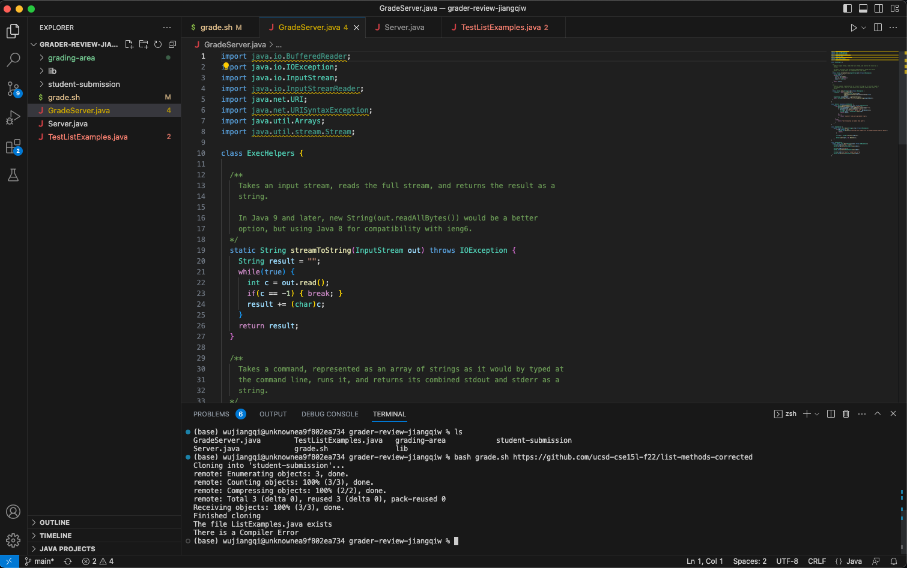
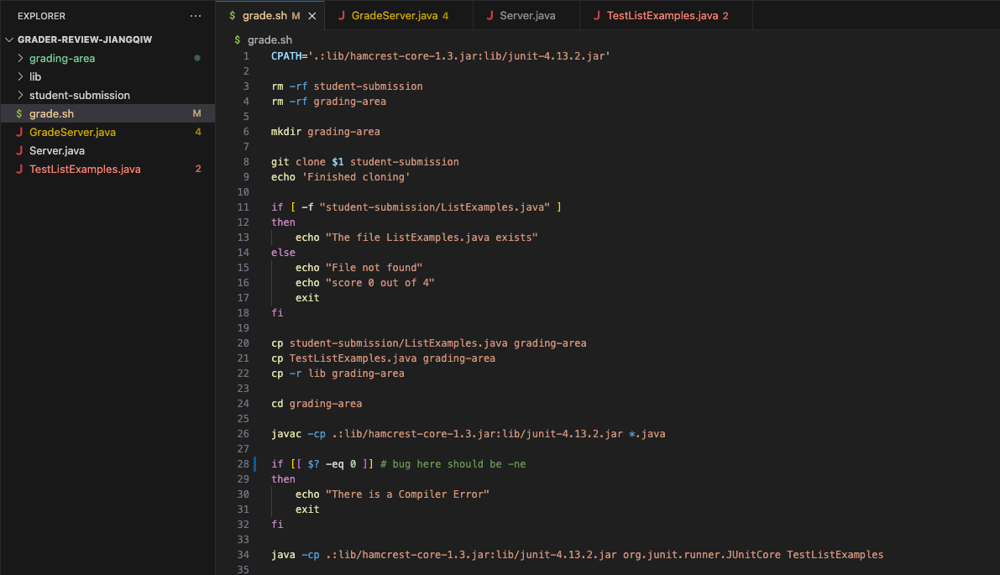
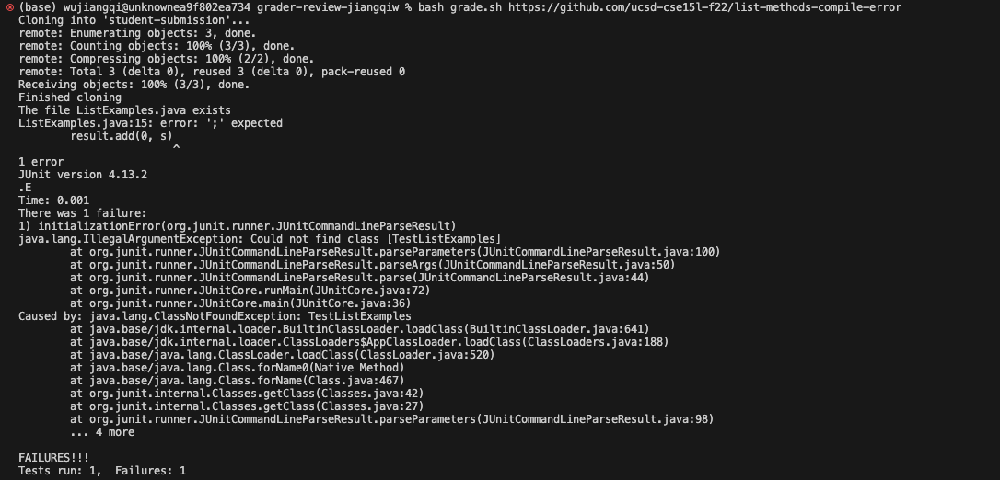

# Lab Report 5: Debugging Scenario

In this lab report, I will design a scenario that a student encounter bugs and TA tries to solve the bug.

> Part1: Origin Post with Bug Description

## Part1: Student's Original Post

### Title: Having weird bug with GradeServer

### Category: Debugging

### Description:

> What environment are you using (computer, operating system, web browser, terminal/editor, and so on)?

I am working on MAC computer and running my code in VS Code terminal.

> Detail the symptom you're seeing. Be specific; include both what you're seeing and what you expected to see instead. Screenshots are great, copy-pasted terminal output is also great. Avoid saying “it doesn't work”.

I have finished coding the grade.sh script and when I was trying to run bash grade.sh with correct implementation, it just shows hint of compiler error of the file. However, the file is supposed to be implemented correctly. Here is a screenshot of running the command.



> Detail the failure-inducing input and context. That might mean any or all of the command you're running, a test case, command-line arguments, working directory, even the last few commands you ran. Do your best to provide as much context as you can.

I have called bash scripts in the directory, and I use the correct implementation of list methods, which is given in the Week 6 lab. Here is the command I run that produce failure:

```
bash grade.sh https://github.com/ucsd-cse15l-f22/list-methods-corrected
```

I was wondering it is possible there is problem with the given implementation?

## Part2: TA's Response

### Response

Hi Jiangqi! In your screenshot, I can see the failure-inducing input and context. I think there is no problem with the given implementation of list methods. However, in the screenshot, I cannot see your code in grade.sh, which could contain
wrong code. Can you show me a screenshot of the grade.sh document?

Also, please try running the program on other list methods example. That could be helpful for finding the error.


## Part3: Student's reply

### Reply

Ok. I have the screenshot of my code in the grade.sh file and also the output when running the file with compiler error.




