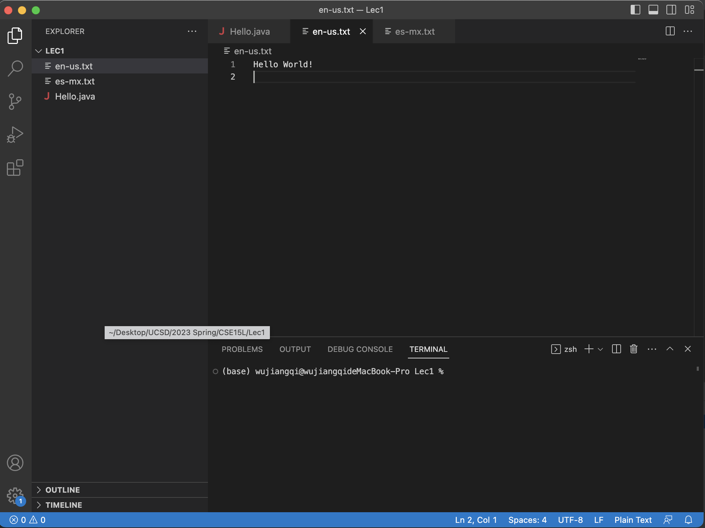

# Week 1 Lab Report -- Tutorial For Setting Up Basics
> Setting up VS Code
> 
I have already downloaded the VS Code during the CSE11 class, but here are the basic steps of setting up

1. Download VS Code
2. Install VS Code
3. Create CSE15L Folder

Here is a screenshot of my VS Code

> Setting up Remote Connecting
1. Find and Reset Account for CSE15L
2. Use Command:
`ssh cs15lsp23zz@ieng6.ucsd.edu` where zz is your account name
3. Enter Password

