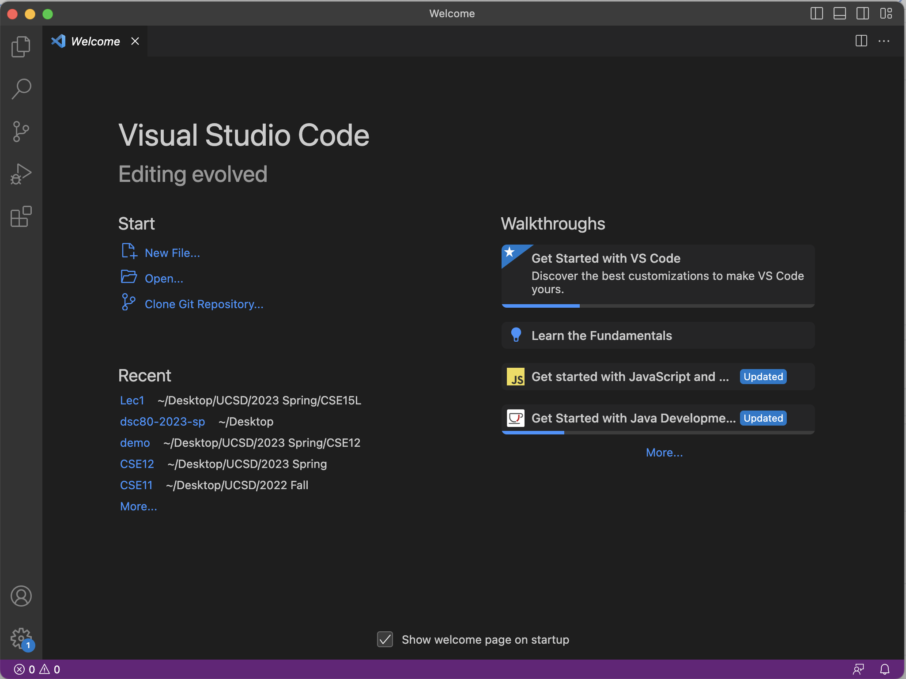
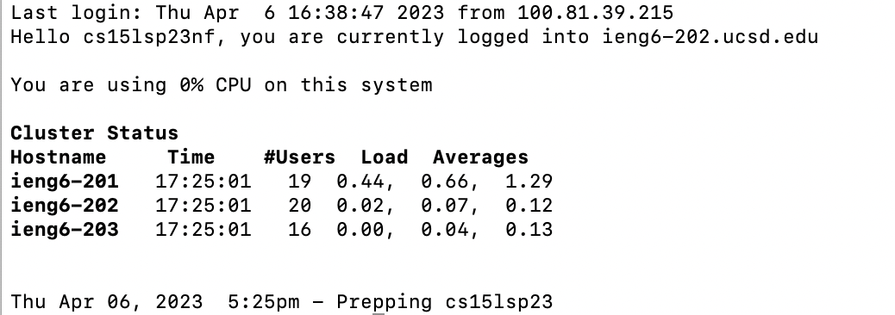
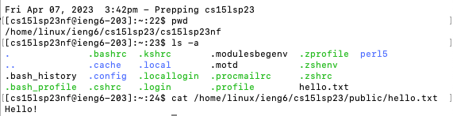

# Week 1 Lab Report -- Tutorial For Setting Up Basics
> Setting up VS Code
> 
I have already downloaded the VS Code during the CSE11 class, but here are the basic steps of setting up

1. Download VS Code
2. Install VS Code
3. Create CSE15L Folder

The link to VS Code installation: [Link](https://code.visualstudio.com/)

Note: It is important to download the correct Windows/Mac/Linux version of the VS Code

Here is a screenshot of my VS Code

> Setting up Remote Connecting
1. Find and Reset Account for CSE15L
2. Use Command:
`ssh cs15lsp23zz@ieng6.ucsd.edu` where zz is your account name
3. Enter Password

Link that can find username: [Link](https://sdacs.ucsd.edu/~icc/index.php)

Link to tutorial to change password: [Link](https://drive.google.com/file/d/17IDZn8Qq7Q0RkYMxdiIR0o6HJ3B5YqSW/view)

Note: if you do everything sucessfull, you should be able to see following:

>Basic Commands
Here are some basic commands that might be useful!

1. `cd` -- change directory
2. `ls` -- list the names and features of files and directories
3. `pwd` -- Print Working Directory
4. `cat` -- concatenate

Here is a screenshot of combination of commands as an example:

